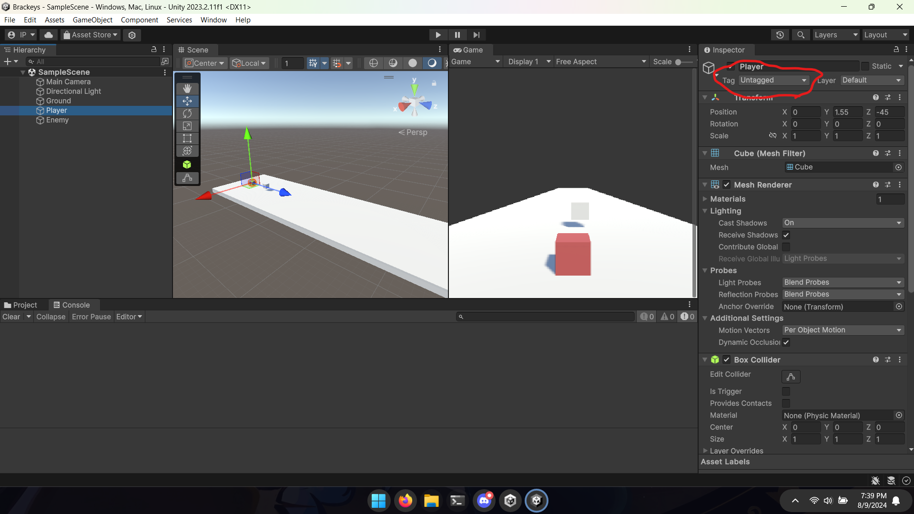
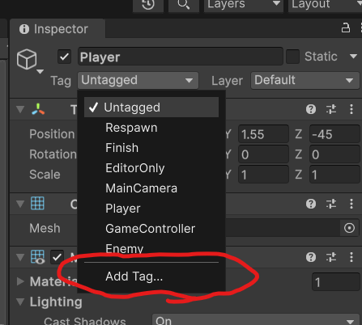
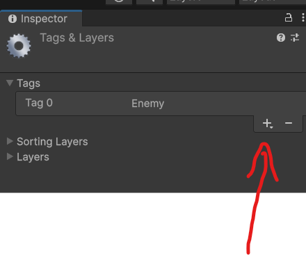
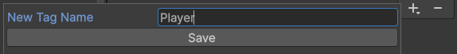
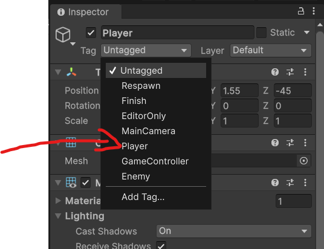

<h1>Como criar uma tag em um GameObject Unity</h1>
Vá até o GameObject que deseja criar uma tag, e clique na opção <i>Untagged</i>
 
Logo após, clique em <i>Add Tag</i>
 
Clique no sinal de positivo e selecione um nome para tua tag
 
 
Agora basta retornar ao GameObject e selecionar a tag criada
 
